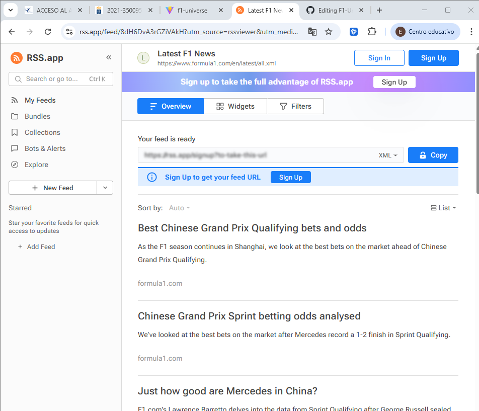

# 🏎️ F1 Universe – Formula 1 2026 Fan App

A modern, responsive React web application that showcases the 2026 Formula 1 season.
The project includes an interactive race calendar, driver grid, contact page, and map integrations using third-party libraries.

---

## 📌 About The Project

**F1 Universe** is a single-page application built with React and Vite.
It provides structured information about the 2026 Formula 1 season in a clean and responsive interface.

The goal of this project was to:

* Apply modern React architecture principles
* Follow clean code conventions
* Use reusable components
* Implement client-side routing
* Integrate third-party libraries
* Ensure responsive design
* Deliver a professional user experience

---
---

## 🌐 Live Demo (Firebase Hosting)

The project is deployed using **Firebase Hosting**.

You can access the live version here:

🔗 **Live URL:**  
(https://f1-universe.web.app)

---


## 🚀 Features

* 🏠 Home page with dynamic race calendar
* 🗺️ Interactive map for the next Grand Prix
* 📊 JSON-based data rendering
* 👨‍🏎️ Drivers grid page
* 📬 Contact page with form and location map
* 📱 Fully responsive layout
* 🔁 Shared Header and Footer components
* 🌍 Client-side routing with React Router
* 🧩 Reusable components with props

---

## 🏗️ Project Structure

```
src/
│
├── assets/
│   ├── drivers/
│   └── races/
│
├── components/
│   ├── header/
│   ├── footer/
│   ├── race-card/
│   ├── driver-card/
│   └── Forum/
|   
│
├── pages/
│   ├── home/
│   ├── drivers/
│   ├── contact/
│   ├── legal/
│   └── news/
│
├── data/
│   ├── f1-2026.json
│   └── drivers-2026.json
│
└── App.jsx
```

### Naming Conventions Used

* Folders → `kebab-case`
* Component files → `PascalCase`
* CSS files → `PascalCase`
* Variables → `camelCase`
* Boolean variables → `is`, `has`, `should` prefixes
* CSS classes and ids → `kebab-case`
* Routes → `kebab-case`

All naming conventions were applied consistently across the project.

---

## 🏠 Home Page

The home page is accessible via:

```
http://localhost:5173
http://localhost:5173/home
```

### It includes:

### 1️⃣ Hero Section

An introductory section presenting the 2026 season.

### 2️⃣ Interactive Map

Built with **React Leaflet**, displaying the location of the next Grand Prix.

### 3️⃣ Race Calendar

Dynamic rendering of races using:

```javascript
racesData.map(...)
```

Each race is displayed using a reusable `RaceCard` component that receives props.

---

## 👨‍🏎️ Drivers Page

Displays the full 2026 driver lineup.

* Rendered dynamically from a JSON data file
* Uses reusable `DriverCard` components
* Responsive grid layout
* Clean and minimal design

---

## 📬 Contact Page

Includes:

* Functional contact form (HTML validation)
* Embedded OpenStreetMap location
* Responsive two-column layout
* Clean form styling

The layout adapts properly to smaller screens using Flexbox and media queries.

---

## 🧩 Reusable Components

The application was built following component-based architecture:

* `Header`
* `Footer`
* `RaceCard`
* `DriverCard`
* `Forum`

Each component:

* Has its own folder
* Has its own CSS file
* Uses props when necessary
* Follows clean code principles

---

## 🛠️ Built With

* **React**
* **Vite**
* **React Router DOM**
* **React Leaflet**
* **Leaflet**
* **React Icons**
* **OpenStreetMap**
* **CSS3 (Flexbox & Grid)**

---

## 🌍 Third-Party Libraries

### React Router DOM

Used for client-side navigation between pages.

### React Leaflet & Leaflet

Used to display interactive maps.

### React Icons

Used for social media icons in the footer.

---

## 📱 Responsive Design

The entire application is fully responsive.

Techniques used:

* Flexbox
* CSS Grid
* Media Queries
* Fluid layouts
* Responsive images

The design adapts correctly to:

* Desktop
* Tablet
* Mobile devices

---

## 🧼 Clean Code Principles Applied

This project follows clean code best practices:

* Small, focused components
* No duplicated logic (DRY principle)
* Meaningful variable and function names
* Consistent file structure
* Minimal and necessary comments only
* Separation of concerns

---

## ⚙️ Installation & Setup

Clone the repository:

```bash
git clone https://github.com/your-username/f1-universe.git
```

Navigate into the project folder:

```bash
cd f1-universe
```

Install dependencies:

```bash
npm install
```

Start development server:

```bash
npm run dev
```

---

## 📦 Branch Structure

The repository includes:

* `main` → Stable production version
* `develop` → Development branch

---

## 📈 Future Improvements

* Add race results section
* Add driver detail pages
* Implement search and filtering
* Add multilingual support (i18n)
* Add backend integration
* Improve form validation with state management

---

## 👤 Author

**Erik**

GitHub:
https://github.com/Erik2007-bot

---

## 📄 License

This project was created for educational purposes only.

---

# 🏁 Final Notes

This project demonstrates:

* Component-based architecture
* Clean and maintainable code
* Proper routing structure
* Third-party integration
* Responsive web design
* Real-world UI/UX considerations


